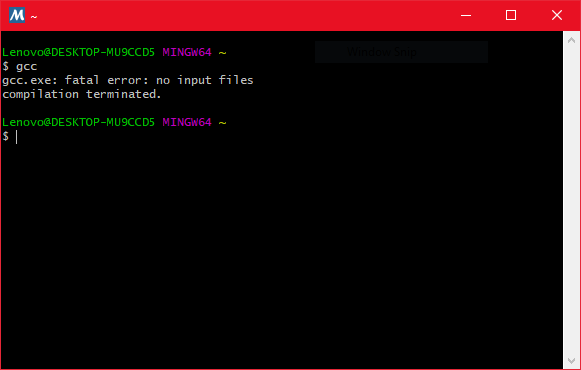

# Instalasi kompiler C di komputer
Setiap sistem operasi (OS) punya caranya masing-masing dalam menginstall kompiler C yang biasanya telah menjadi satu paket dengan kompiler lainnya seperti C++ dan Fortran. Selain itu, kompiler C juga mempunyai banyak macamnya seperti gcc, clang, dan lainnya. Namun di tulisan ini, hanya akan diterangkan kompiler C untuk GCC saja.

## Windows
Di sistem operasi Windows, direkomendasikan untuk instal menggunakan MSYS2, karena MSYS2 mirip seperti terminal di Linux yang bisa digunakan untuk menginstal modul-modul serupa dengan Linux. Tidak seperti WSL yang memang benar-benar Linux, MSYS2 ini masih merupakan sistem operasi Windows, sehingga hasil kompilernya kompatibel dengan sistem operasi Windows.

MSYS2 dapat di download di [https://www.msys2.org/](https://www.msys2.org/).

di [situs](https://www.msys2.org/) resminya, MSYS2 telah memiliki tutorial cara untuk instalasi berikut dengan instalasi `gcc` dan `make`.

Setelah selesai instalasi, hal pertama yang bisa dilakukan ialah mengecek apakah `gcc` telah terinstal dengan cara memberikan perintah `gcc` di terminal MSYS2



## Linux (Ubuntu)
Setiap distro pada Linux umumnya memiliki beberapa *package manager* atau program penginstal yang berbeda. Distro berbasis Arch umumnya menggunakan `pacman` (mirip dengan MSYS2), sedangkan Distro berbasis Ubuntu biasanya menggunakan `apt`. Hal ini juga berlaku bagi komputer yang menggunakan WSL (Windows Subsystem Linux).

Pertama-tama, gcc dapat dicek terlebih dahulu di terminal Linux (karena biasanya telah tersedia, kecuali WSL). Jika belum, maka untuk Ubuntu dapat diinstal dengan menggunakan perintah

```bash
sudo apt install gcc
```

## Cek versi gcc di komputer
Pengecekan versi pada gcc dapat dilakukan dengan menggunakan perintah:

```bash
gcc --version
```

Sehingga akan muncul tampilan seperti di bawah ini (pada contoh MSYS2):

```bash
$ gcc --version
gcc.exe (Rev5, Built by MSYS2 project) 10.3.0
Copyright (C) 2020 Free Software Foundation, Inc.
This is free software; see the source for copying conditions.  There is NO
warranty; not even for MERCHANTABILITY or FITNESS FOR A PARTICULAR PURPOSE.
```
